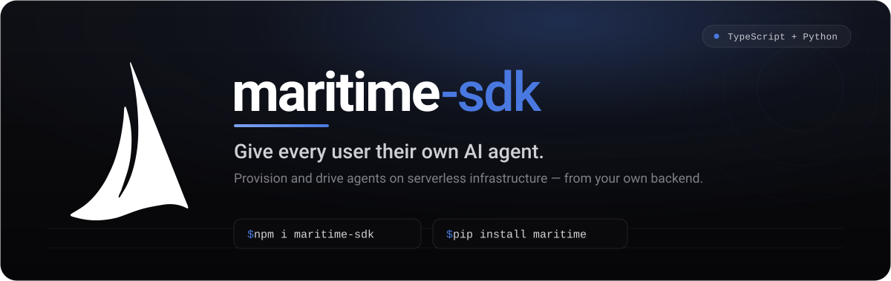
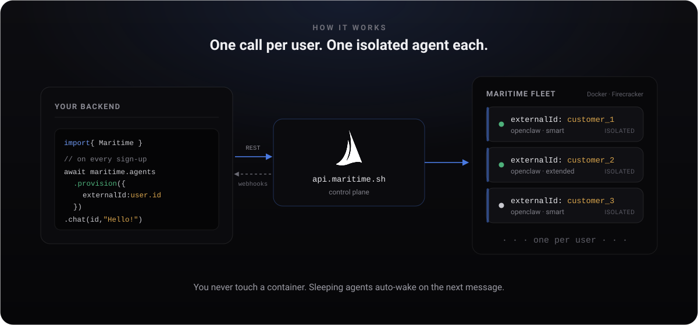

<div align="center">

<a href="https://maritime.sh"></a>

<br/>

**Official TypeScript & Python SDKs for [Maritime](https://maritime.sh).**
Provision and drive AI agents on serverless infrastructure — straight from your own backend.

<br/>

[](https://www.npmjs.com/package/maritime-sdk)
[](https://pypi.org/project/maritime/)
[](typescript/)


[](LICENSE)

<samp>[**Documentation**](https://maritime.sh/docs/build) · [**Quick start**](#-quick-start) · [**Examples**](examples/) · [**API reference**](https://maritime.sh/docs/api) · [**maritime.sh**](https://maritime.sh)</samp>

</div>

<br/>

Build an app where every one of **your** users gets **their own** agent. One call on sign-up spins up an isolated agent on Maritime's fleet; another sends it a message. It runs on Docker or Firecracker microVMs, sleeps when idle, and wakes on the next message. **You never touch a container.**

| Language | Package | Install | Source |
| --- | --- | --- | --- |
| **TypeScript / JavaScript** | [`maritime-sdk`](https://www.npmjs.com/package/maritime-sdk) | `npm install maritime-sdk` | [`typescript/`](typescript/) |
| **Python** | [`maritime`](https://pypi.org/project/maritime/) | `pip install maritime` | [`python/`](python/) |

<br/>

<div align="center">

</div>

<br/>

## ⚡ Quick start

Mint an API key (`mk_…`) from the dashboard (**Settings → API keys**) or the CLI (`maritime keys create`), set `MARITIME_API_KEY`, and you're one call away from a live agent.

### TypeScript

```ts
import { Maritime } from 'maritime-sdk'

const maritime = new Maritime({ apiKey: process.env.MARITIME_API_KEY })

// When YOUR user signs up, give them their own agent.
// `provision` is idempotent on externalId — safe to call on every login.
const agent = await maritime.agents.provision({
  externalId: `customer_${user.id}`,   // your id for this agent
  name: `assistant-${user.id}`,
  template: 'openclaw',
})

// Talk to it — sleeping agents auto-wake:
const { response } = await maritime.agents.chat(agent.id, 'Summarize my unread email.')
console.log(response)
```

### Python

```python
from maritime import Maritime

client = Maritime()  # reads MARITIME_API_KEY

# Idempotent on external_id — safe to call on every login.
agent = client.agents.provision(
    external_id=f"customer_{user.id}",
    name=f"assistant-{user.id}",
    template="openclaw",
)

reply = client.agents.chat(agent["id"], "Summarize my unread email.")["response"]
print(reply)
```

> Both SDKs are **zero-dependency** (TS uses the platform `fetch`; Python is pure standard library) and ship with full type hints.

<br/>

## ✨ Features

| | |
| --- | --- |
| **⚓ One agent per user** | `provision()` is get-or-create on your own `externalId` — call it on every sign-in, get exactly one isolated agent back. |
| **💤 Serverless economics** | Agents auto-sleep when idle and auto-wake on the next message. Sleeping agents cost next to nothing (Firecracker snapshots). |
| **🔑 Scoped API keys** | Hand a subsystem the narrowest key it needs — `provision`, `deploy`, `secrets`, or `manage`. A leaked key can only do what its scope allows. |
| **🪝 Signed webhooks** | Subscribe to agent lifecycle events (`agent.deployed`, `agent.error`, …) with an `X-Maritime-Signature` HMAC — no polling. |
| **🔒 Encrypted secrets** | Set per-agent env vars; secrets are encrypted at rest and hot-reloaded into the running container. |
| **♻️ Safe by construction** | Typed error hierarchy, request IDs, and retries that never replay a write that might have applied. |

<br/>

## 🧭 The API at a glance

```ts
// Agents ──────────────────────────────────────────────
maritime.agents.provision({ externalId, name, template })  // get-or-create
maritime.agents.create({ name, template, instructions, env, tier })
maritime.agents.get(id)
maritime.agents.list({ externalId })       // filter by your own id
maritime.agents.chat(id, message)          // auto-wakes → { response }
maritime.agents.start(id) / .sleep(id) / .restart(id) / .stop(id) / .delete(id)
maritime.agents.setEnv(id, key, value, { secret: true })   // +list/delete/reload
maritime.agents.logs(id, { limit, level })

// API keys ────────────────────────────────────────────
maritime.keys.create({ name, scopes: ['deploy'] })   // rawKey shown once
maritime.keys.list() / .revoke(id)

// Webhooks ────────────────────────────────────────────
maritime.webhooks.create({ url, events })   // secret shown once
maritime.webhooks.list() / .delete(id) / .test(id)
```

Every method exists in both SDKs with the same names (Python uses `snake_case`: `set_env`, `reload_env`, …). Full reference: **[maritime.sh/docs/api](https://maritime.sh/docs/api)**.

<br/>

## 🔑 Scoped keys

Mint a narrow key for each subsystem and hand out the least privilege it needs.

| Scope | Grants |
| --- | --- |
| `provision` | create agents |
| `deploy` | start / stop / restart / sleep / chat |
| `secrets` | read / write env vars |
| `manage` | everything, incl. delete + key management (wildcard) |

```ts
// A worker that only chats never needs the power to delete anything:
const worker = await maritime.keys.create({ name: 'chat-worker', scopes: ['deploy'] })
// worker.rawKey is shown once — store it now.
```

<br/>

## 🪝 Webhooks

Stop polling. Subscribe a URL and verify each delivery's HMAC signature with the secret returned once at creation.

```ts
import crypto from 'node:crypto'

function verify(rawBody: string, signature: string, secret: string) {
  const digest = crypto.createHmac('sha256', secret).update(rawBody).digest('hex')
  return signature === `sha256=${digest}`
}
```

The event body carries the agent's `external_id`, so you can route it straight back to your own customer.

<br/>

## 🚦 Error handling

Every failure is a subclass of `MaritimeError` — catch the base to catch them all, or narrow by type.

```ts
import { MaritimeConflictError, MaritimeAPIError } from 'maritime-sdk'

try {
  await maritime.agents.create({ name: 'dupe', template: 'openclaw' })
} catch (err) {
  if (err instanceof MaritimeConflictError) {
    // 409 — an agent with that name already exists
  } else if (err instanceof MaritimeAPIError) {
    console.error(err.status, err.detail, err.requestId)
  }
}
```

| Class | When |
| --- | --- |
| `MaritimeAuthError` | `401` / `403` — bad or under-scoped key |
| `MaritimePaymentRequiredError` | `402` — wallet needs funding |
| `MaritimeNotFoundError` | `404` — no such agent (or not yours) |
| `MaritimeConflictError` | `409` — name already taken |
| `MaritimeRateLimitError` | `429` |
| `MaritimeAPIError` | any other non-2xx (has `.status`, `.detail`, `.requestId`) |
| `MaritimeConnectionError` | never reached Maritime (network / timeout) |

<br/>

## 📁 Examples

Runnable, copy-paste examples for both languages live in [`examples/`](examples/) — every one verified to compile against the published packages.

| Example | TypeScript | Python |
| --- | --- | --- |
| Provision one agent per user on sign-up | [`provision-on-signup.ts`](examples/typescript/provision-on-signup.ts) | [`provision_on_signup.py`](examples/python/provision_on_signup.py) |
| Full chat API (Express / FastAPI) | [`express-chat-api.ts`](examples/typescript/express-chat-api.ts) | [`fastapi_app.py`](examples/python/fastapi_app.py) |
| Next.js App Router route | [`nextjs-route.ts`](examples/typescript/nextjs-route.ts) | — |
| Webhook receiver + signature verification | [`webhook-receiver.ts`](examples/typescript/webhook-receiver.ts) | [`flask_webhook.py`](examples/python/flask_webhook.py) |
| Mint a narrowly-scoped key | [`scoped-key.ts`](examples/typescript/scoped-key.ts) | [`scoped_key.py`](examples/python/scoped_key.py) |
| Manage per-customer secrets | [`manage-secrets.ts`](examples/typescript/manage-secrets.ts) | [`manage_secrets.py`](examples/python/manage_secrets.py) |

<br/>

## ⚙️ Configuration

```ts
new Maritime({
  apiKey: 'mk_...',                     // or MARITIME_API_KEY
  baseUrl: 'https://api.maritime.sh',   // or MARITIME_API_URL
  timeout: 60_000,                      // per-request ms
  maxRetries: 2,                        // network + 5xx/429, write-safe
  fetch: customFetch,                   // inject a fetch (tests, proxies)
  defaultHeaders: { 'x-team': 'acme' },
})
```

Retries are safe by construction: `GET`/`DELETE` retry on any transient failure; `POST`/`PUT` retry only on network errors and `429`/`503` — never a `5xx` that might have applied a write.

<br/>

## 📚 Resources

- **Guide** — [maritime.sh/docs/build](https://maritime.sh/docs/build)
- **REST API reference** — [maritime.sh/docs/api](https://maritime.sh/docs/api)
- **CLI** — [`maritime-cli`](https://www.npmjs.com/package/maritime-cli) (`maritime keys create`, `maritime chat`, …)
- **TypeScript SDK** — [`typescript/`](typescript/) · [](https://www.npmjs.com/package/maritime-sdk)
- **Python SDK** — [`python/`](python/) · [](https://pypi.org/project/maritime/)

<br/>

## License

[MIT](LICENSE) © Maritime

<div align="center"><br/><sub>Built for developers who want to ship agents, not operate them. <a href="https://maritime.sh">maritime.sh</a></sub></div>
